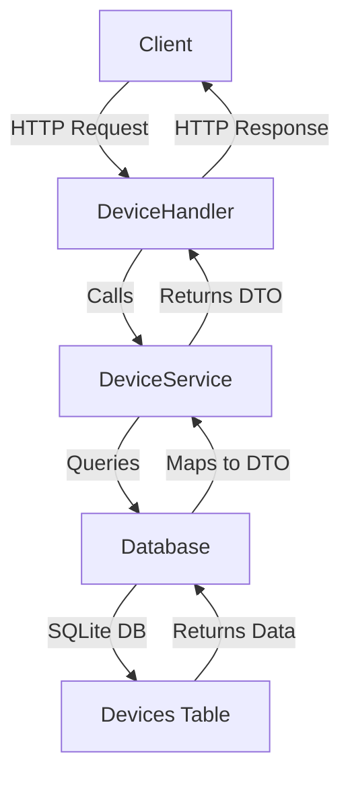

# **DeviceManagementAPI (Go)**

A RESTful API built with Go to manage devices, providing CRUD operations for device entities. The project uses GORM with an SQLite database for persistence and follows a clean architecture with services, handlers, and data models. It includes Swagger support for API documentation.

## **Table of Contents**

- [**Features**](#features)
- [**Project Structure**](#project-structure)
- [**Architecture Diagram**](#architecture-diagram)
- [**Prerequisites**](#prerequisites)
- [**Setup Instructions**](#setup-instructions)
- [**Running the Project**](#running-the-project)
- [**API Endpoints**](#api-endpoints)
- [**Running Tests**](#running-tests)
- [**License**](#license)

## **Features**

- **CRUD Operations**: Create, Read, Update, and Delete devices.
- **SQLite Database**: Uses GORM with an SQLite database for persistence.
- **Input Validation**: Validates device names and types in the API.
- **Unit Tests**: Comprehensive tests for services using Go’s testing package.
- **Dependency Injection**: Follows Go best practices for dependency injection.
- **Clean Architecture**: Separates concerns into handlers, services, and data layers.
- **Swagger Support**: Interactive API documentation using Swagger UI.

## **Project Structure**

The project is organized into several directories and files:

- **cmd/api/**: Entry point for the application.
  - `main.go`: Main application file that sets up the server and routes.
- **internal/data/**: Manages database models and context.
  - `database.go`: GORM database setup.
  - `models.go`: Device model definition.
- **internal/dtos/**: Data Transfer Objects for API requests and responses.
  - `dtos.go`: DTOs for device data.
- **internal/handlers/**: HTTP request handlers.
  - `device_handler.go`: Handlers for device endpoints.
- **internal/services/**: Business logic layer.
  - `device_service.go`: Implements device-related business logic.
- **tests/**: Unit tests for the project.
  - `device_service_test.go`: Tests for the `DeviceService`.
- **docs/**: Generated Swagger documentation.
  - `swagger.json`: Swagger API definition.

## **Architecture Diagram**

The following Mermaid diagram illustrates the flow of data through the application:



- **Client**: Sends HTTP requests (e.g., GET, POST) to the API.
- **DeviceHandler**: Handles incoming HTTP requests and returns responses.
- **DeviceService**: Contains business logic and interacts with the database.
- **Database**: Manages database operations using GORM.
- **Devices Table**: Represents the SQLite database table for devices.

## **Prerequisites**

To run this project, ensure you have the following installed:

- **Go 1.24.2**: Download from [https://go.dev/dl/](https://go.dev/dl/).
- **Docker and Docker Compose**: For containerized deployment.
- **IDE (Optional)**: Visual Studio Code with Go extension, or any Go-compatible IDE.
- **Git**: For cloning the repository.
- **Command Line Tool**: Terminal, PowerShell, or Command Prompt for running commands.

## **Setup Instructions**

### **Clone the Repository**

```bash
git clone https://github.com/yourusername/DeviceManagementAPI-Go.git
cd DeviceManagementAPI-Go
```

### **Install Dependencies**

Install the required Go packages, including Swagger dependencies, and ensure all dependencies are resolved:

```bash
go mod tidy
go get -u github.com/swaggo/swag/cmd/swag
go get -u github.com/swaggo/gin-swagger
go get -u github.com/swaggo/files
```

### **Generate Swagger Documentation**

Generate Swagger documentation for the API:

```bash
swag init -g cmd/api/main.go
```

### **Verify the Project**

Ensure the project builds successfully:

```bash
go build -o main ./cmd/api
```

## **Running the Project**

You can run the project either directly on your machine or using Docker.

### **Run Locally**

```bash
go run ./cmd/api
```

### **Run with Docker**

Ensure you have a `Dockerfile` and `docker-compose.yaml` in the project root. Build and run the application using Docker Compose:

```bash
docker-compose up --build
```

The API will start on `http://localhost:8080`. You can use tools like Postman, `curl`, or Swagger UI to test the endpoints.

## **API Endpoints**

The API provides the following endpoints under the `/api/devices` route:

| **Method** | **Endpoint**         | **Description**            | **Request Body**                           | **Response**                  |
|------------|----------------------|----------------------------|--------------------------------------------|-------------------------------|
| GET        | `/api/devices`       | Retrieve all devices       | None                                       | `200 OK` with device list     |
| GET        | `/api/devices/{id}`  | Retrieve a device by ID    | None                                       | `200 OK` or `404 Not Found`   |
| POST       | `/api/devices`       | Create a new device        | `{ "name": "iPhone 15", "type": "Smart phone" }` | `201 Created`                 |
| PUT        | `/api/devices/{id}`  | Update an existing device  | `{ "name": "iPhone 15 Max", "type": "Smart phone" }` | `200 OK` or `404 Not Found`   |
| DELETE     | `/api/devices/{id}`  | Delete a device by ID      | None                                       | `204 No Content` or `404 Not Found` |

### **Example Requests**

#### **Get All Devices**

```bash
curl http://localhost:8080/api/devices
```

#### **Create a Device**

```bash
curl -X POST http://localhost:8080/api/devices -H "Content-Type: application/json" -d '{"name":"iPhone 15","type":"Smart phone"}'
```

## **Running Tests**

The project includes unit tests for the service layer using Go’s testing package.

### **Run All Tests**

```bash
go test ./internal/services -v
```

This will run all tests in the `internal/services` directory. You should see output indicating the number of tests passed or failed.

### **Test Structure**

- **device_service_test.go**: Tests for the `DeviceService`, covering all business logic methods.

**Expected Output**:

```
=== RUN   TestDeviceService_GetAllDevices_WhenDevicesExist
--- PASS: TestDeviceService_GetAllDevices_WhenDevicesExist (0.01s)
...
PASS
ok      github.com/yourusername/DeviceManagementAPI-Go/internal/services    0.012s
```

Please ensure all tests pass and add new tests for any new functionality.

## **License**

This project is licensed under the MIT License. See the [LICENSE](LICENSE) file for details.
